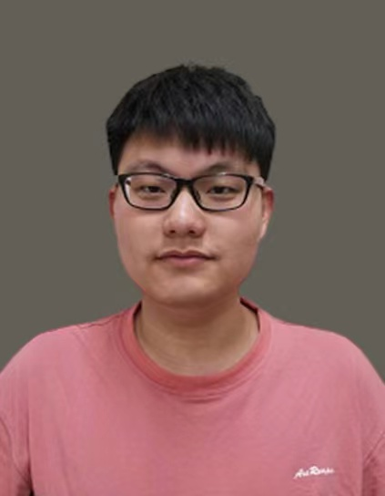

# Short Bio
Chao Wang received the B.S. degree in intelligent science and technology in 2019 from Xidian University, Xi’an, China, where he is currently studying for my doctorate at Xidian University, Xidian University, China. His current research interests include multitasking optimization and learning, evolutionary computation, and complex networks (Graphs).

# Publications and Preprint
### Preprint
1. Kai Wu, **Chao Wang***, Junyuan Chen, Jing Liu. Network Collaborator: Knowledge Transfer Between Network Reconstruction and Community Detection from Dynamics[J]. arXiv preprint arXiv:2201.01134, 2022, _IEEE TETCI_, submitted. [[paper](https://arxiv.org/abs/2201.01134)] [[code](https://github.com/xiaofangxd/EMTNRCD)]

2. **Chao Wang**, Jiaxuan Zhao, Lingling Li, Licheng Jiao*, Jing Liu, Kai Wu. A Multi-Transformation Evolutionary Framework for Influence Maximization in Social Networks[J]. arXiv preprint arXiv:2204.03297, 2022, _IEEE CIM_, Under Scond Review. [[paper](https://arxiv.org/abs/2204.03297)] [[code](https://github.com/xiaofangxd/MTEFIM)]

3. **Chao Wang**, Licheng Jiao*, Jiaxuan Zhao, Lingling Li, Xu Liu, Fang Liu, Shuyuan Yang. Bi-level Multi-objective Evolutionary Learning, 2022, _IEEE TEVC_, Submitted. [[code](https://github.com/xiaofangxd/BLMOL)]

### Journal Papers
1. **C. Wang**, K. Wu*, and J. Liu, "Evolutionary Multitasking AUC Optimization [Research Frontier]," in _IEEE Computational Intelligence Magazine_ (IF: 9.809, SCI II), vol. 17, no. 2, pp. 67-82, May 2022. [[paper](https://ieeexplore.ieee.org/abstract/document/9756594)] [[code](https://github.com/xiaofangxd/EMTAUC)]

2. **C. Wang**, J. Liu*, K. Wu, and Z. Wu, "Solving Multitask Optimization Problems With Adaptive Knowledge Transfer via Anomaly Detection," in _IEEE Transactions on Evolutionary Computation_ (IF: 16.497, SCI I), vol. 26, no. 2, pp. 304-318, April 2022. [[paper](https://ieeexplore.ieee.org/abstract/document/9385398)] [[code](https://github.com/xiaofangxd/MTEA-AD)]

3. K. Wu, **C. Wang***, and J. Liu, "Evolutionary Multitasking Multilayer Network Reconstruction," in _IEEE Transactions on Cybernetics_ (IF: 19.118, SCI I), 2022. [[paper](https://ieeexplore.ieee.org/abstract/document/9489377)] [[code](https://github.com/xiaofangxd/EM2MNR)]

4. **C. Wang**, J. Liu*, K. Wu, and C. Ying, "Learning Large-scale Fuzzy Cognitive Maps Using an Evolutionary Many-task Algorithm," _Applied Soft Computing_ (IF: 8.263, SCI I), vol. 108, 2021, 107441. [[paper](https://www.sciencedirect.com/science/article/abs/pii/S1568494621003641)] [[code](https://github.com/xiaofangxd/IBMTEA-FCM)]

5. Kai Wu, **Chao Wang**, Jing Liu, "Multilayer Nonlinear Dynamical Network Reconstruction from Streaming Data," _SCIENTIA SINICA Technologica_, vol. 52, no. 6, pp. 971-982, 2022. or 吴凯, **王超**, 刘静*, 流数据驱动的非线性动力学网络重构, 中国科学: 技术科学, vol. 52, no. 6, pp. 971-982, 2022. [[paper](https://www.sciengine.com/SST/doi/10.1360/SST-2020-0491)] [[code](https://github.com/SparseL/OMNR)]

6. C. Ying, J. Liu, K. Wu, and **C. Wang**, "A Multiobjective Evolutionary Approach for Solving Large-Scale Network Reconstruction Problems via Logistic Principal Component Analysis," in _IEEE Transactions on Cybernetics_ (IF: 19.118, SCI I), 2022. [[paper](https://ieeexplore.ieee.org/abstract/document/9537739)] [[code](https://github.com/xiaofangxd/SLEMO-NR)]

### Conference Papers
1. K. Wu, J. Liu*, **C. Wang**., K. Yuan, "Pareto Optimization for Influence Maximization in Social Networks," In: , et al. _Evolutionary Multi-Criterion Optimization_. EMO 2021. [[paper](https://link.springer.com/chapter/10.1007/978-3-030-72062-9_55)] [[code](https://github.com/SparseL/POIM)]

# Research Topic
The main research directions are multitasking optimization and learning, natural evolution strategy, and complex networks (Graphs).
### Evolutionary Multitasking Optimization [1]
Evolutionary Multitasking Optimization is a paradigm that focuses on solving multiple self-contained tasks at the same time. Inspired by the well-established concepts of transfer learning and multi-task learning in predictive analytics, the key motivation behind multitask optimization is that if optimization tasks are related to each other (in terms of their optimal solutions, or the general characteristics of their function landscapes), then the search progress on one can be transferred to substantially speedup the search on the other. Notably, the success of the paradigm is not necessarily limited to one-way knowledge transfers from simpler to more complex tasks. In fact, in an attempt to intentionally solve a harder task, several simpler ones may often be unintentionally solved.

### Multi-task Learning as Multi-objective Optimization [2]
In multi-task learning, multiple tasks are solved jointly, sharing inductive bias between them. Multi-task learning is inherently a multi-objective problem because different tasks may conflict, necessitating a trade-off. We explicitly cast multi-task learning as multi-objective optimization, with the overall objective of finding Pareto optimal solution set.

### Natural Evolution Strategy for Deep Learning [3]
Natural evolution strategies (NES) are a family of numerical optimization algorithms for black box problems. Similar in spirit to evolution strategies, they iteratively update the (continuous) parameters of a search distribution by following the natural gradient towards higher expected fitness.

### Automatic Graph Representation Learning [4]
Graph machine learning has been extensively studied in both academic and industry. However, as the literature on graph learning booms with a vast number of emerging methods and techniques, it becomes increasingly difficult to manually design the optimal machine learning algorithm for different graph-related tasks. To tackle the challenge, automated graph machine learning, which aims at discovering the best hyper-parameter and neural architecture configuration for different graph tasks/data without manual design, is gaining an increasing number of attentions from the research community. We extensively discuss automated graph machine approaches, covering hyper-parameter optimization (HPO) and neural architecture search (NAS) for graph machine learning.

### Influence maximization [5]
Influence Maximization (IM), which selects a set of k users (called seed set) from a social network to maximize the expected number of influenced users (called influence spread), is a key algorithmic problem in social influence analysis. Due to its immense application potential and enormous technical challenges, IM has been extensively studied in the past decade. We focus on the following key aspects: (1) proxy models, (2) a rigorous theoretical of evolutionary IM algorithms.

[1] Gupta A, Ong Y S, Feng L. Multifactorial evolution: toward evolutionary multitasking[J]. IEEE Transactions on Evolutionary Computation, 2015, 20(3): 343-357.

[2] Sener O, Koltun V. Multi-task learning as multi-objective optimization[J]. Advances in neural information processing systems, 2018, 31.

[3] Wierstra D, Schaul T, Glasmachers T, et al. Natural evolution strategies[J]. The Journal of Machine Learning Research, 2014, 15(1): 949-980.

[4] Wang X, Zhang Z, Zhu W. Automated Graph Machine Learning: Approaches, Libraries and Directions[J]. arXiv preprint arXiv:2201.01288, 2022.

[5] Li Y, Fan J, Wang Y, et al. Influence maximization on social graphs: A survey[J]. IEEE Transactions on Knowledge and Data Engineering, 2018, 30(10): 1852-1872.

# This Site
This blog mainly shares and records the problems encountered in my scientific research.

# Posts

The posts are at different status.

| Status    | Meaning                                                      |
| --------- | ------------------------------------------------------------ |
| Completed | This post is considered completed, but I might edit it when I came up with something new. |
| Writing   | This post is being actively edited.                          |
| Paused    | This post is considered of low priority. I will come back to this post later. |
| Archived  | This post is outdated and I probably won't update it anymore. |

# Contact

The best way to reach me is via email: xiaofengxd@126.com.

[My homepage of Google Scholar](https://scholar.google.com/citations?user=Nj-aZHoAAAAJ&hl=zh-CN)

# Quick Links
[IEEE CIS](https://cis.ieee.org/publications) [IEEE CIM](https://ieeexplore.ieee.org/xpl/RecentIssue.jsp?punumber=10207) [IEEE TEC](https://ieeexplore.ieee.org/xpl/RecentIssue.jsp?punumber=4235) [IEEE TNNLS](https://ieeexplore.ieee.org/xpl/RecentIssue.jsp?punumber=5962385) [IEEE TFS](https://ieeexplore.ieee.org/xpl/RecentIssue.jsp?punumber=91) [IEEE TAI](https://ieeexplore.ieee.org/xpl/RecentIssue.jsp?punumber=9078688) [IEEE TETCI](https://ieeexplore.ieee.org/xpl/mostRecentIssue.jsp?punumber=7433297) [IEEE TCYB](https://ieeexplore.ieee.org/xpl/RecentIssue.jsp?punumber=6221036) [IEEE TSMC](https://ieeexplore.ieee.org/xpl/RecentIssue.jsp?punumber=6221021)

[JMLR](https://www.jmlr.org/) [AIJ](https://www.journals.elsevier.com/artificial-intelligence) [ECJ](https://direct.mit.edu/evco) 

[IEEE CS](https://www.computer.org/) [IEEE TPAMI](https://ieeexplore.ieee.org/xpl/RecentIssue.jsp?punumber=34) [IEEE TKDE](https://ieeexplore.ieee.org/xpl/RecentIssue.jsp?punumber=69) 

[CCF](https://www.ccf.org.cn/Academic_Evaluation/By_category/)
