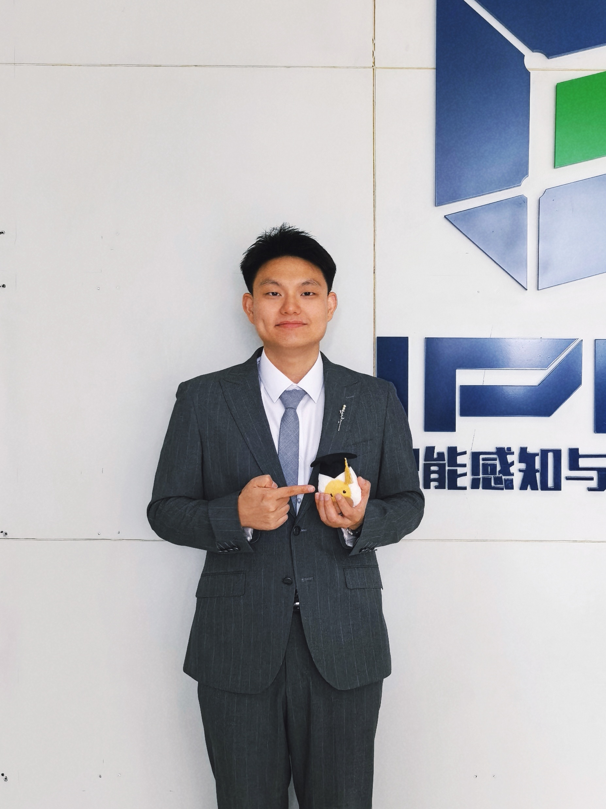

<meta name="viewport" content="width=device-width, initial-scale=1.0, maximum-scale=1.0, user-scalable=no">

<table style="width:100%; border:0px; border-spacing:0px; border-collapse:collapse;">
  <tr style="border:0px;">
    <td style="width:140px; vertical-align:top; border:0px; padding-right:20px;">
      
    </td>
    <td style="vertical-align:top; border:0px;">
      <h2 style="margin-top:0;">Chao Wang (王超)</h2>
      

        <b>Postdoc, Associate Researcher</b> 
        <a href="https://sai.xidian.edu.cn/">School of Artificial Intelligence</a>, <a href="https://www.xidian.edu.cn/">Xidian University</a>
      

      

        <b>Advisors:</b> <a href="https://scholar.google.com/citations?user=FZbrL2YAAAAJ">Prof. Licheng Jiao</a> (IEEE Fellow) 
        <b>Co-Advisors:</b> <a href="https://faculty.xidian.edu.cn/LJ22/zh_CN/index.htm">Prof. Jing Liu</a>, <a href="https://scholar.google.com/citations?user=4zGSPzsAAAAJ">Prof. Kai Wu</a>
      

      

        📧 xiaofengxd@126.com  
        📍 Xi'an, China
      

    </td>
  </tr>
</table>

  <a href="https://scholar.google.com/citations?user=Nj-aZHoAAAAJ">Google Scholar</a> &nbsp;|&nbsp;
  <a href="https://www.researchgate.net/profile/Chao-Wang-408">ResearchGate</a> &nbsp;|&nbsp;
  <a href="https://github.com/xiaofangxd">GitHub</a> &nbsp;|&nbsp;
  <a href="https://blog.csdn.net/qq_40434430">CSDN</a> &nbsp;|&nbsp;
  <a href="https://www.aminer.cn/profile/649e35e41d157a8656d0095c">Aminer</a> &nbsp;|&nbsp;
  <a href="https://faculty.xidian.edu.cn/wangchao/zh_CN/index.htm">Chinese Homepage</a>

---

## 🔬 Research Interests

My research focuses on the intersection of evolutionary computation and machine learning:
* **Evolutionary Knowledge Transfer**
* **Meta Black-box Optimization**
* **LLM-assisted Evolutionary Computation**
* **Automated Machine Learning**

---

## 📝 Publications

### First-author Papers (\*)

1. **C. Wang\***, L. Jiao, L. Li, et al. *Task-free Adaptive Meta Black-box Optimization*. **International Conference on Learning Representations (ICLR)**, 2026. (CAAI A) [[Paper](https://openreview.net/forum?id=AufVSUgMUo)] [[Code](https://github.com/xiaofangxd/ABOM)]
1. **C. Wang\***, J. Zhao, L. Jiao, et al. *When large language models meet evolutionary algorithms: Potential enhancements and challenges*. **Research** (Science Partner Journal), 2025. (IF: 10.9, JCR I) [[Paper](https://arxiv.org/abs/2401.10510)]
1. **C. Wang\***, J. Zhao, L. Li, et al. *Knowledge-aware Evolutionary Graph Neural Architecture Search*. **Knowledge-Based Systems**, 2024. (IF: 7.2, JCR I, CAAI B) [[Paper](https://arxiv.org/abs/2411.17339)] [[Code](https://github.com/xiaofangxd/KEGNAS)]
1. **C. Wang\***, J. Zhao, L. Li, et al. *Automatic Graph Topology-Aware Transformer*. **IEEE Transactions on Neural Networks and Learning Systems (IEEE TNNLS)**, 2024. (IF: 10.2, JCR I, CAAI A) [[Paper](https://ieeexplore.ieee.org/document/10681642)] [[Code](https://github.com/xiaofangxd/EGTAS)]
1. **C. Wang\***, J. Zhao, L. Li, et al. *Bi-level Multi-objective Evolutionary Learning: A Case Study on Multi-task Graph Neural Topology Search*. **IEEE Transactions on Evolutionary Computation (IEEE TEVC)**, 28(1):208–222, 2024. (IF: 11.7, JCR I, CAAI A) [[Paper](https://ieeexplore.ieee.org/abstract/document/10065594)] [[Code](https://github.com/xiaofangxd/BLMOL)]
1. **C. Wang\***, J. Zhao, L. Li, et al. *A Multi-Transformation Evolutionary Framework for Influence Maximization in Social Networks*. **IEEE Computational Intelligence Magazine (IEEE CIM)**, 18(1):52–67, 2023. (IF: 9, JCR I, CAAI B) [[Paper](https://ieeexplore.ieee.org/document/10026148)] [[Code](https://github.com/xiaofangxd/MTEFIM)]
1. **C. Wang\***, J. Liu, K. Wu, et al. *Evolutionary Multitasking AUC Optimization*. **IEEE Computational Intelligence Magazine (IEEE CIM)**, 17(2):67–82, 2022. (IF: 9.8, JCR I, CAAI B) [[Paper](https://ieeexplore.ieee.org/abstract/document/9756594)] [[Code](https://github.com/xiaofangxd/EMTAUC)]
1. **C. Wang\***, J. Liu, K. Wu, et al. *Solving Multitask Optimization Problems with Adaptive Knowledge Transfer via Anomaly Detection*. **IEEE Transactions on Evolutionary Computation (IEEE TEVC)**, 26(2):304–318, 2022. (IF: 16.5, JCR I, CAAI A) [[Paper](https://ieeexplore.ieee.org/abstract/document/9385398)] [[Code](https://github.com/xiaofangxd/MTEA-AD)]
1. **C. Wang\***, J. Liu, K. Wu, et al. *Learning Large-scale Fuzzy Cognitive Maps Using an Evolutionary Many-task Algorithm*. **Applied Soft Computing**, 108:107441, 2021. (IF: 8.3, JCR I) [[Paper](https://www.sciencedirect.com/science/article/abs/pii/S1568494621003641)] [[Code](https://github.com/xiaofangxd/IBMTEA-FCM)]
1. **C. Wang\***, J. Zhao, L. Jiao, et al. *Learning Evolution via Optimization Knowledge Adaptation*. arXiv preprint, 2025. [[Paper](https://arxiv.org/abs/2501.02200)]
1. **C. Wang\***, J. Zhao, L. Li, et al. *Pareto Automatic Multi-Task Learning on Graphs*. 2023 (preprint).

### Corresponding-author Papers (†)

1. T. Ma, **C. Wang†**, K. Wu, et al. *Network Collaborator: Knowledge Transfer Between Network Reconstruction and Community Detection*. **Neurocomputing**, 2025 (accepted). (IF: 6.5, JCR I) [[Paper](https://arxiv.org/abs/2201.01134)] [[Code](https://github.com/xiaofangxd/EMTNRCD)]
1. K. Wu, **C. Wang†**, J. Liu. *Evolutionary Multitasking Multilayer Network Reconstruction*. **IEEE Transactions on Cybernetics (IEEE TCYB)**, 52(12):12854–12868, 2022. (IF: 19.1, JCR I, CAAI A) [[Paper](https://ieeexplore.ieee.org/abstract/document/9489377)] [[Code](https://github.com/xiaofangxd/EM2MNR)]

### Collaborative Papers

1. J. Zhao, L. Jiao\*, **C. Wang**, et al. *S3Diffuser: Frequency selected state space guided diffusion model for multimodal fusion classification*. **Information Fusion**, 2025. (IF: 15.5, JCR I, CAAI A)
1. L. Jiao\*, J. Zhao, **C. Wang**, et al. *Nature-inspired Intelligent Computing: A Comprehensive Survey*. **Research** (Science Partner Journal), 2024. (IF: 8.5, JCR I) [[Paper](https://spj.science.org/doi/10.34133/research.0442)]
1. J. Zhao, L. Jiao\*, **C. Wang**, et al. *Knowledge Guided Evolutionary Transformer for Remote Sensing Scene Classification*. **IEEE Transactions on Circuits and Systems for Video Technology (IEEE TCSVT)**, 2024. (IF: 8.4, JCR I, CAAI B) [[Paper](https://ieeexplore.ieee.org/document/10542522)]
1. J. Zhao, L. Jiao\*, **C. Wang**, et al. *GeoFormer: A Geometric Representation Transformer for Change Detection*. **IEEE Transactions on Geoscience and Remote Sensing (IEEE TGRS)**, 61:1–17, 2023. (IF: 8.2, JCR I, CAAI A) [[Paper](https://ieeexplore.ieee.org/document/10314551)]
1. H. Zhao\*, X. Ning, X. Liu, **C. Wang**, J. Liu. *What Makes Evolutionary Multi-task Optimization Better*. **Applied Soft Computing**, 145:110545, 2023. (IF: 8.26, JCR I) [[Paper](https://www.sciencedirect.com/science/article/pii/S156849462300563X)]
1. C. Ying, J. Liu, K. Wu, **C. Wang**. *A Multiobjective Evolutionary Approach for Solving Large-Scale Network Reconstruction Problems*. **IEEE Transactions on Cybernetics (IEEE TCYB)**, 53(4):2137–2150, 2023. (IF: 19.1, JCR I, CAAI A) [[Paper](https://ieeexplore.ieee.org/abstract/document/9537739)] [[Code](https://github.com/xiaofangxd/SLEMO-NR)]
1. K. Wu, J. Liu\*, **C. Wang**, Yuan. *Pareto Optimization for Influence Maximization in Social Networks*. **Evolutionary Multi-Criterion Optimization (EMO)**, 2021. [[Paper](https://link.springer.com/chapter/10.1007/978-3-030-72062-9_55)] [[Code](https://github.com/SparseL/POIM)]
   
---

## 🧩 Selected Projects

| Topic | Description | Links |
| :--- | :--- | :--- |
| **Transfer Optimization** | Adaptive knowledge transfer, multitasking network reconstruction. | [MTEA-AD](https://github.com/xiaofangxd/MTEA-AD) / [EM2MNR](https://github.com/xiaofangxd/EM2MNR) |
| **Meta BBO** | Adaptive meta black-box optimization. | [ABOM](https://openreview.net/forum?id=AufVSUgMUo) / [OKAEM](https://arxiv.org/abs/2501.02200) / [BLMOL](https://github.com/xiaofangxd/BLMOL) |
| **LLM-assisted EA** | LLMs as evolutionary operators and heuristic designers. | [Survey](https://arxiv.org/abs/2401.10510) / [Repo](https://github.com/xiaofangxd/LLM_EA) |
| **Auto Graph ML** | Evolutionary graph NAS, topology-aware transformers. | [KEGNAS](https://github.com/xiaofangxd/KEGNAS) / [EGTAS](https://github.com/xiaofangxd/EGTAS) |

---

## 🔗 Quick Links

**Journals** [IEEE CIS](https://cis.ieee.org/publications) • [IEEE CIM](https://ieeexplore.ieee.org/xpl/RecentIssue.jsp?punumber=10207) • [IEEE TEVC](https://ieeexplore.ieee.org/xpl/RecentIssue.jsp?punumber=4235) • [IEEE TNNLS](https://ieeexplore.ieee.org/xpl/RecentIssue.jsp?punumber=5962385) • [IEEE TCYB](https://ieeexplore.ieee.org/xpl/RecentIssue.jsp?punumber=6221036) • [IEEE TSMC](https://ieeexplore.ieee.org/xpl/RecentIssue.jsp?punumber=6221021) • [IEEE TPAMI](https://ieeexplore.ieee.org/xpl/RecentIssue.jsp?punumber=34) • [IEEE TKDE](https://ieeexplore.ieee.org/xpl/RecentIssue.jsp?punumber=69) • [JMLR](https://www.jmlr.org/) • [AIJ](https://www.journals.elsevier.com/artificial-intelligence) • [ECJ](https://direct.mit.edu/evco) • [ACM TELO](https://dl.acm.org/journal/telo) • [SWEVO](https://www.sciencedirect.com/journal/swarm-and-evolutionary-computation) • [ARTL](https://direct.mit.edu/artl) • [SCIS](https://www.springer.com/journal/11432) • [NMI](https://www.nature.com/natmachintell/) • [NC](https://www.nature.com/ncomms/) • [PNAS](https://www.pnas.org/latest)

**Conferences** [FOGA, GECCO, PPSN, CEC](https://ryojitanabe.github.io/ecconf/)

**Publishers & Resources** [IEEE CS](https://www.computer.org/) • [IEEE Xplore (Proc. IEEE)](https://ieeexplore.ieee.org/xpl/RecentIssue.jsp?punumber=5) • [CCF Rankings](https://www.ccf.org.cn/Academic_Evaluation/By_category/) • [Nature](https://www.nature.com/) • [Science](https://www.science.org/) • [arXiv cs.NE](https://arxiv.org/list/cs.NE/recent)

